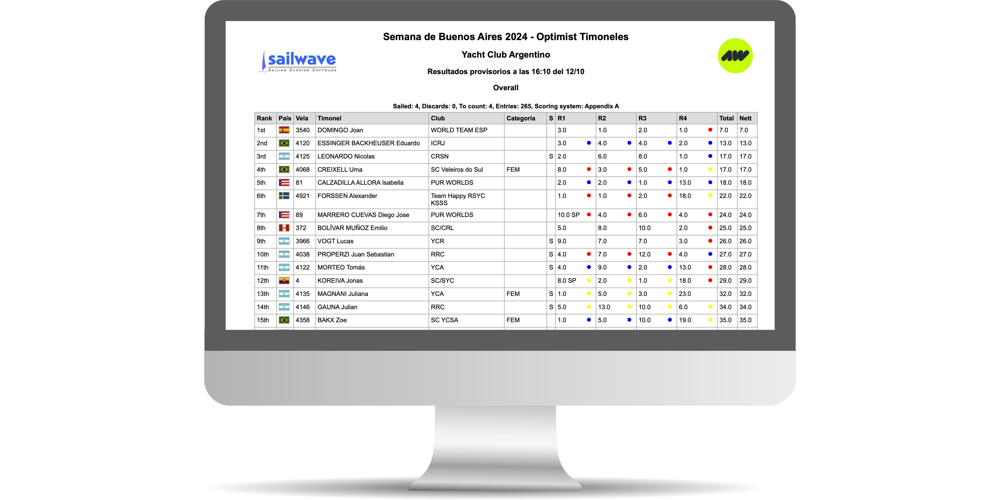
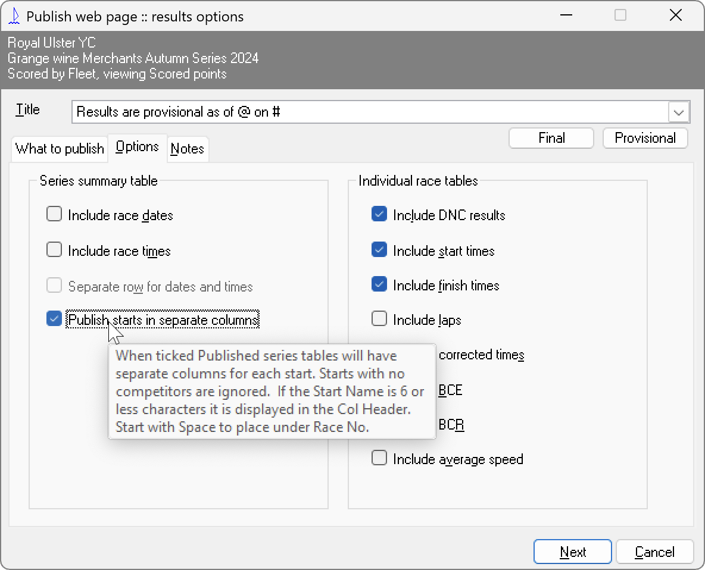

### Sailwave - publish fleet color in each result cell


Script preparado en conjunto con [@nicloos](https://github.com/nicloos/nicloos) para agregar un diamante (o un círculo) del color de la flota al lado del puesto de cada regata en la publicación de resultados utilizando [Sailwave](https://www.sailwave.com/).

El script considera que la publicación se realiza con cada flota en una columna diferente (x ejemplo para un campeonato de 4 flotas habrá 4 columnas para la regata 1, 4 para la regata 2, etc). La imagen que sigue muestra cómo configurar esta publicación en Sailwave.



Si no se quiere usar el script desde Effects, se lo puede llamar desde el html generado con Sailwave, agregando el enlace al final del html, antes de cerrar el body. En este caso, en que el script está en la misma carpeta que el html:

```
<script src="./dom-manipulation.js"></script>

```

Hay dos versiones:

- 1. El color de la flota se inserta con un caracter HTML que puede ser un diamante o un círculo (rama main)
- 2. El color se inserta mediante un span circular (rama span)

> [!WARNING]
> Respecto a los colores de las flotas

Se establecieron colores para 7 flotas (si hubiera más habría que agregar más opciones al array de colores - las opciones deben contener el nombre de un color existente, o el código HEX)
Los colores en el array se corresponden a los siguientes colores de flota, en el orden en que acá se muestran👇

- AMARILLO
- AZUL
- ROJO
- BLANCO
- VERDE
- MARRON
- VIOLETA
